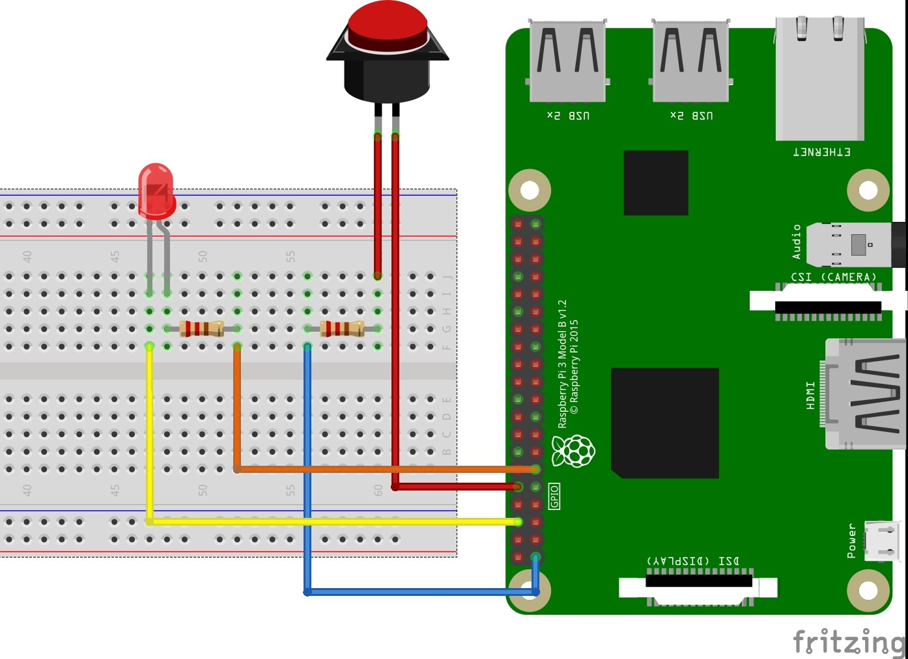
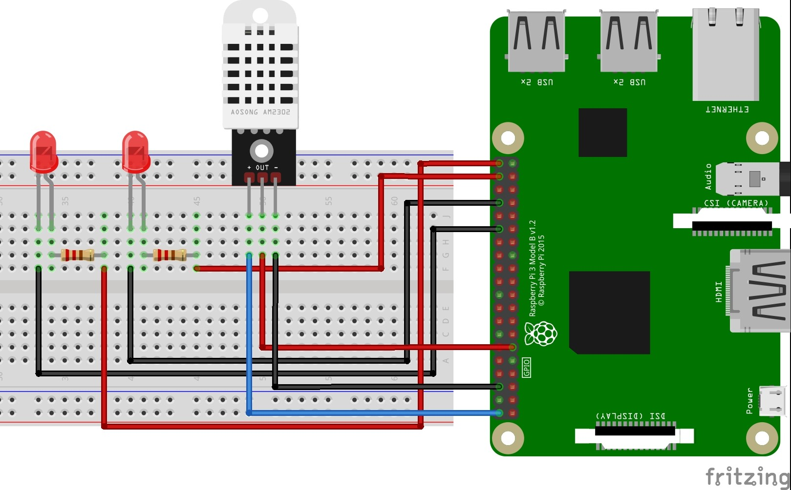
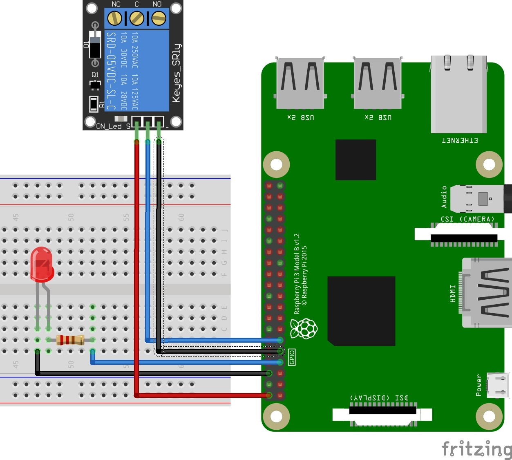
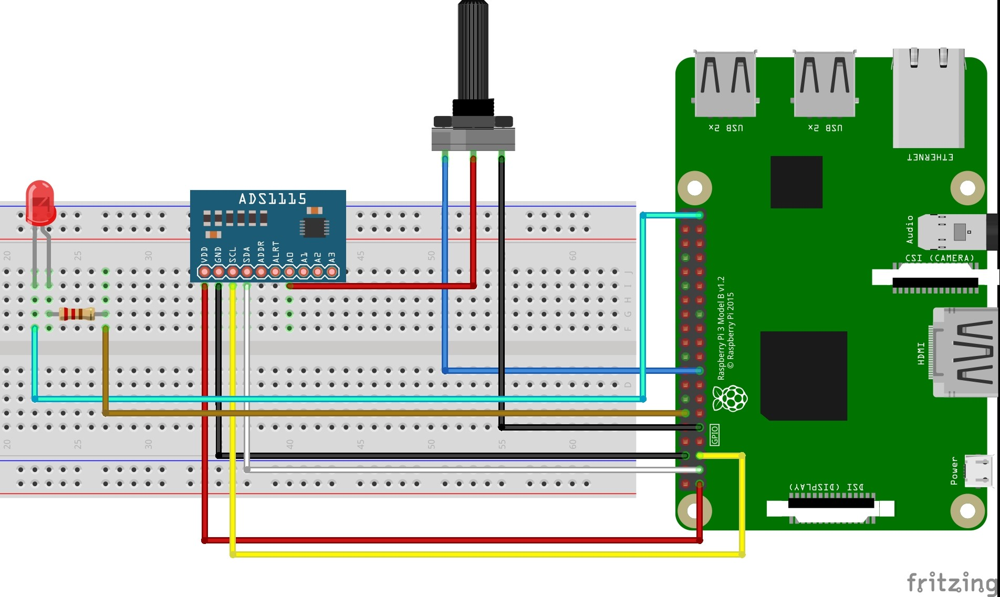

# raspberry-pi-projects
Personal Raspberry Pi projects and experiments with sensors, automation, and Python.

## Raspberry Pi 3 — Sensor & Control Circuits  
This repository contains a series of educational circuits developed on the **Raspberry Pi 3** to demonstrate fundamental principles of electronics, GPIO programming, and sensor control using **Python**.  

It includes **hardware, software, and four circuits**, designed for clarity and educational presentation.

## Hardware Overview  
- **Model:** Raspberry Pi 3 Model B  
- **CPU:** Quad-core 1.2GHz processor  
- **GPU:** Dual-core VideoCore IV  
- **RAM:** 1GB  
- **Ports:** 4× USB, HDMI output, 40× GPIO pins  
- **Power:** Micro USB (5V)  

## Software Setup  
- **Operating System:** Raspberry Pi OS (Linux)  
- **Programming Language:** Python 3  
- **IDE:** PyCharm / Thonny / Visual Studio Code  
- **Terminal Access:** via HDMI or SSH  

### Tools  
- **PuTTY** – terminal emulator for remote access  
- **PyCharm** – IDE for Python development  

## Circuits Overview  

### 1. LED Control with Push Button  
**File:** `button_led.py`  
- **Goal:** Toggle an LED using a push button.  
- **Connections:**  
  - LED → GPIO 17 → GND  
  - Button → GPIO 27 → 3.3V  
- **Library:** `RPi.GPIO`  
- **Description:** Demonstrates basic GPIO input/output interaction.




### 2. Temperature-Based LED Control (DHT22 Sensor)  
**File:** `temp_led_control.py`  
- **Goal:** Light up LEDs based on DHT22 temperature readings.  
- **Connections:**  
  - DHT22 → GPIO 17, 5V, GND  
  - LED1 → GPIO 20, GND  
  - LED2 → GPIO 21, GND  
- **Logic:**  
  - Temp < 25°C → LED1 ON  
  - Temp ≥ 25°C → LED2 ON  
- **Library:** `Adafruit_DHT`  




### 3. Relay Activation on Fault Condition  
**File:** `relay_led_fault.py`  
- **Goal:** Simulate a system fault that triggers a relay and LED alert.  
- **Connections:**  
  - Relay → GPIO 17, 5V, GND  
  - LED → GPIO 4, GND  
- **Library:** `RPi.GPIO`  




### 4. LED Brightness Control via Potentiometer (PWM + ADS1115)  
**File:** `pwm_led_ads1115.py`  
- **Goal:** Control LED brightness using a potentiometer via ADS1115 ADC.  
- **Connections:**  
  - ADS1115 → VDD (3.3V), GND, SDA (GPIO 2), SCL (GPIO 3)  
  - Potentiometer → 3.3V, GND, A0  
  - LED → GPIO 18 (PWM), GND  
- **Library Installation:**  
  ```bash
  pip3 install adafruit-circuitpython-ads1x15
  ```  
- **Description:** Reads the analog value from the potentiometer and maps it to LED brightness using PWM.  




## Running the Code  

### 1. Clone the Repository  
```bash
git clone https://github.com/<your-username>/raspberrypi-projects.git
cd raspberrypi-projects
```

### 2. Install Dependencies  
```bash
sudo apt-get update
sudo apt-get install python3-pip
pip3 install RPi.GPIO Adafruit_DHT adafruit-circuitpython-ads1x15
```

### 3. Run a Script 
```bash
python3 button_led.py
```

### 4. Stop Execution Safely  
Press `Ctrl + C`

## Tools & Components  
- Breadboard and jumper wires  
- LEDs and resistors (330Ω)  
- DHT22 temperature and humidity sensor  
- Relay module  
- Potentiometer (10kΩ)  
- ADS1115 ADC module  

## Author  
**[Kalliopi Angeli]**  

## License  
Licensed under the **MIT License**.  
Free for educational use, modification, and distribution.  
